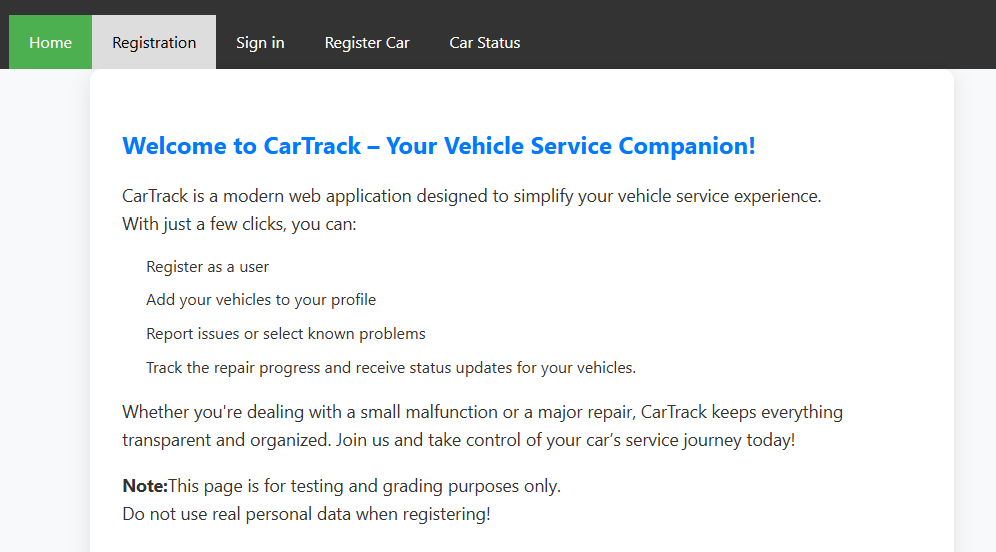
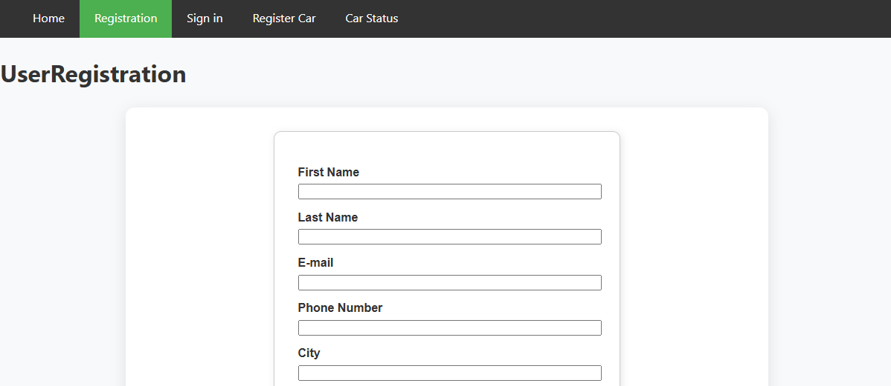
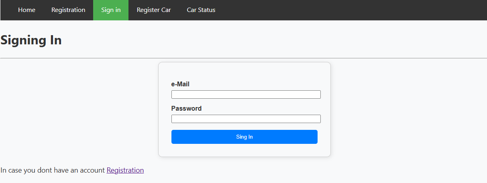

# CarTrack – Vehicle Service Registration System

**CarTrack** is a web-based application designed to streamline the vehicle service process. Users can register, add their vehicles, and conveniently monitor service progress from their browser.

The application is built using the **WebSharper** client-server model with **HTML templates**. Data is stored using **SQLite**.

---

## Live Demo

Try the application live: [Hosted on Azure]https://autotrack-g3fqakhcddbzhqf3.northeurope-01.azurewebsites.net/
*Note: This is a preview version — some features may still be under development.*

---

## Project Status: In Development

This application is currently in development and is expected to be feature-complete by the **end of the semester**.

---

## Currently Available Features

- New user registration  
- Vehicle registration linked to user accounts  
- Viewing the repair status of registered vehicles  

---

## Features Under Construction

- Updating vehicle status by service staff  
- Setting or updating repair costs for each vehicle  

These features are actively being developed and will be included in upcoming updates.

---

## Estimated Completion

The core functionality is planned to be completed by **the end of the semester**.

---

## Stay Updated

Further updates and improvements will be shared as the project progresses.  
Thank you for your interest and support!

---

## Some Pictures of the app

