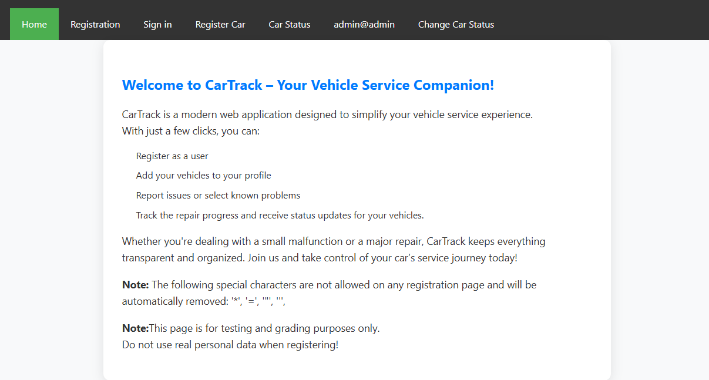

# CarTrack – Vehicle Service Registration System

**CarTrack** is a web-based application designed to streamline the vehicle service process. Users can register, add their vehicles, and conveniently monitor service progress from their browser.

---

## Used Technologies

The application is built using the **WebSharper** client-server model with **HTML templates**.  
Data is stored using **SQLite**.

I initially attempted to use **Entity Framework** for database operations, but I ran into compatibility issues.  
Due to time constraints and my prior familiarity with MySQL and SQLite, I decided to use low-level SQL commands instead.

---

## Live Demo

Try the application live: [Hosted on Azure]https://autotrack-g3fqakhcddbzhqf3.northeurope-01.azurewebsites.net/
This is my first time using Azure for hosting, and I encountered some major stability issues.  
If a part of the application doesn't seem to work, please try closing the browser tab and reopening it.

---

## Project Status: All planned functionality has been implemented.

The application is ready for testing.

Users can register, register a vehicle for maintenance, and track the status of their owned cars as well as the estimated repair costs.

Staff members can view all registered vehicles and update their status, malfunctions, and repair costs.

---

## The Admin page:

An admin user was created for testing purposes.  
On the admin page, staff members can add new malfunctions to the database.  
If the "Handover" option is selected, the current car will be moved to the Archive table and removed from the main database.  
Repair costs and malfunctions can also be modified.

---

## Some Pictures of the app

The main page provides information about the app.

The user registration page.

The signing in page:

The admin page for staff members:

